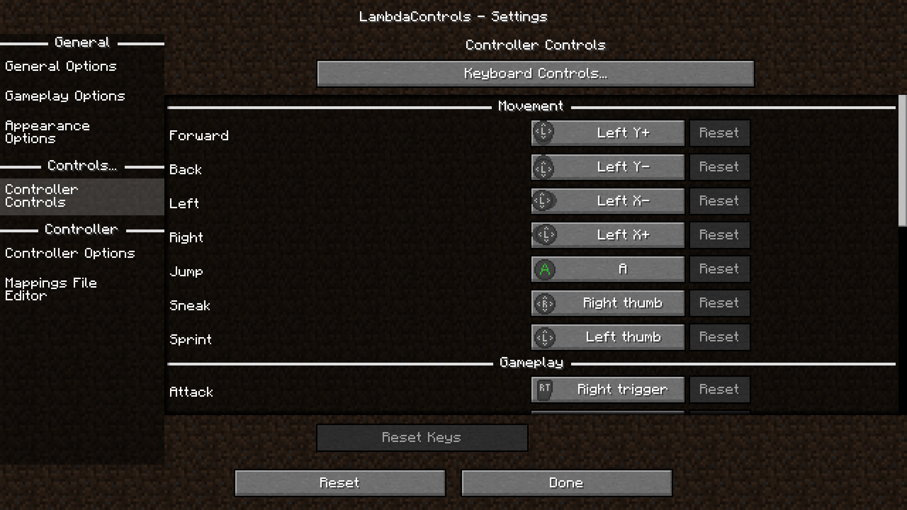
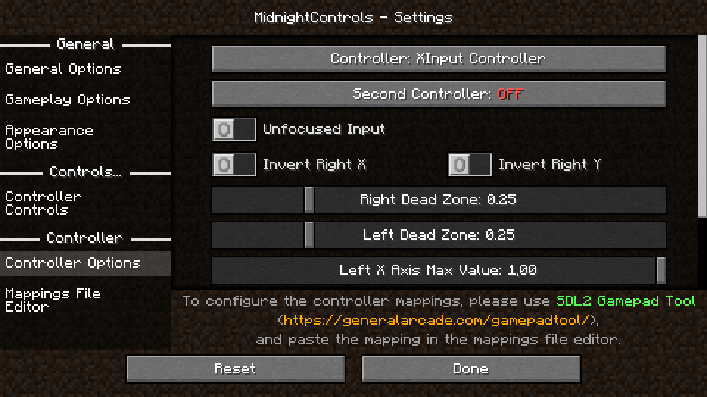

<div align="center">


# MidnightControls

[](https://www.curseforge.com/minecraft/mc-mods/midnightcontrols)
[![Modrinth]](https://modrinth.com/mod/midnightcontrols)
[](https://github.com/TeamMidnightDust/MidnightControls/releases)

[![Mod loader: Quilt/Fabric]][Quilt]
[](https://www.oracle.com/java/technologies/downloads/#java17)
[](LICENSE)

A Fabric Minecraft mod which adds better controls, reach-around and controller support.  
Forked from [LambdaControls](https://github.com/LambdAurora/LambdaControls) by the amazing [LambdAurora](https://github.com/LambdAurora), which was sadly discontinued.

</div>

## What's this mod?

MidnightControls is a mod which provides controller and touchscreen support in Minecraft: Java Edition.<br />It also includes some Bedrock Edition parity and reach-around features!

## Features:

- Controller support
- Touchscreen support
- Keyboard controls to look around.
- Toggleable on screen button indicator (like in Bedrock Edition).
- Vertical reach-around.
- Many Bedrock Edition features:
   - Toggleable fly drifting
   - Front block placing (be careful with this one)
- New controls settings!
- Many options in config to change to your liking.
- Many controllers supported and in a simple way your own controller mappings.
- An easy API for developers to add their own button bindings.

## 🎮 Supported Controllers:

- DualShock controllers
- DualSense controllers
- Xbox controllers
- Switch Pro controllers
- Joy-Cons
- Steam controller and Steam Deck (WIP)
- And many more!

## Screenshots




## Build

Clone the repo with:
```
git clone https://github.com/TeamMidnightDust/MidnightControls
```
Enter the folder created and run:
```
./gradlew build
```
After this is done, everything should be built just fine!

## FAQ:
### The controller does not work, and it's name appears in orange, what can I do?  
Create a custom mapping as pointed out in the [wiki](https://midnightdust.eu/wiki/midnightcontrols/)

[Quilt]: https://quiltmc.org

[Mod loader: Quilt/Fabric]: https://img.shields.io/badge/modloader-Quilt%2FFabric-blueviolet?logo=data:image/png;base64,iVBORw0KGgoAAAANSUhEUgAAAEAAAABACAYAAACqaXHeAAAACXBIWXMAAADGAAAAxgGwdJvFAAAFU0lEQVR4nO1bwW7bOBCdCHtP+wUNxIvhS7yA7kkPOjf9AKPam4/OF2zzB96bblXhH0jPPkS5G1jnIvgib/IFtX/ALoYZemmKtEWRRe3aDzAsURbJGQ6HM4/02Wq1gmNGcNTSnxQA8IdakDK4AOCfJpj3SpiI98r2rAMAbxrWNWFFOMeL1nCJdXQa1gPTbpCbnm34ABIeBThv2hgAfOyVcF+2ZwkAfHGo54kVIRe6NVxiny4d6vpn2g36ugfqFLhwFB6kkUoc67k0XLv0qYKj9wEnBXiqZwEAf/ZKOOuV8BkLWBFesyI8A4C/LOt6AoC39C7HtBvg9Vt65hUnC/BUDzrOf1MGq5S9WkDZnuVle7ZqsBKgw/tO73K0hku8/u64EmhxsoA96MMvxdEroBIKO+CWoshnqqJPYTAGRJ8sql3QO3Op7D19D3z7AV8KeAGArFf+32lWhDwnKNuzuaUCclaE93KBiOU9hMQV+FLAOxz9lPHRR0VkZXs2oBDUNon5ULZnKOgcYwl4FTwna/K+CtRRwIK+dTnCCwkP9I0fkXmh4FcN+6UKqqtHblvtb+18po4TvKaPilsS8qVuYx5havsbJXS1I0ZVAXP1B5jfyzm+hAnN+We1XPluioX03kJtY9oNtG1T+b1aburDxhRAQVMGHw3z9k65F41nktmjUnjjrAj7ZXv27ECIyEKgBd7saBuka7lsPu0GA1MjR0+KVpwgMTlrMkN4YoztlZ/2camTvD0QjcWZF6KxMgcLyKbdAN+HKOb1y6PYH49gEsUwUKw1G48gi2KQZcApkYxH1eldUQBxeKbkRfXEQjDZ21+h2bMiHJDwH2wk1rSX0XWueHZd2yCZ/oVSnilTaA3VAiqjRRahQ0JBjuov3ijfPqAua0kUg67tmyjWCmvsS504wGQRnywjPJ8wtY3xw3827fjMBXziUalL3DcNrIzYRwXcTbvBZ7lgPHoNxKKYky1/+2xsHxXQbw2X/EIoggQHyjC9Yh8VcC6NshDc66jLOHpC5KSAPejDL8U+KuArboTQZgjHeARn+MFnvhvbRyfYaQ2XfNkTVFgUr/mIxlvkJuyjAjCae6BrYQUPW37vhDpT4MnAsCyIgbHBnYbcADJt7/t+deBCiSWsCG8sOv5IgU2FnJh2g+RnBDl1oCpgogqEx1TEURUFokx+tpCYnEzzjg1kh+fq/Ix9OXpG6OjjgI1VIGWcOMhlXh4PPdAz1VTe90rIU8Z/L9JUnALXSK4SjSUzOY+Y1ekyOlzjaamTvf3X8cjunBH1v6OeVtsG1QI66qYEVkoVmyA/O5fYmIHjgSsrskUavAc6q1BLeXXiANMZu0HKwGav7opGv+LticZqHOToLBeZrJRxC97qjOsowCTgZYO9OlNa25haMwgvsFMJPp3gLW1ji8b6dO89fhfYIbzAl23T4adtjyNvD6/mbbs9Xgs1hRcwWoIvCxDb47nQNm5aRDHvoPGcblNYCi+gtQSfU+AdLYfioLXYtHA9eruBhsILVJRwUIGQo/ACG0o4GAV4El5grQSffMA3SqbEnBdb1zeunfYsvAB3jL4UwE92KauA2NnNbLerNKhEqJ6Q+FIAOjpcATAVzjFHoC3qC9OurCW0W9s+6vXpAy4p0hPkSUL3ziNHiY3tqfNdQN4jORgnSEGMLyU8Udbq1QIEdEyRF3hSwlp4vKkwQimrHDuxAR6S4tleFIPzERnhSFXQEtbkD1kbwiMOlhJroISK8IiDpcQsp4NWeMRBc4I1lWAUHnHwpOgOJWwVHvFbsMIGJewUHvFb7QuQYxR/ttgIzbUAgB9KOM3uc+PN7QAAAABJRU5ErkJggg==

[Modrinth]: https://img.shields.io/modrinth/dt/bXX9h73M?logoColor=white&logo=data:image/svg%2bxml;base64,PHN2ZyB2aWV3Qm94PSIwIDAgNTEyIDUxNCIgeG1sbnM9Imh0dHA6Ly93d3cudzMub3JnLzIwMDAvc3ZnIj4KICA8cGF0aCBmaWxsLXJ1bGU9ImV2ZW5vZGQiIGNsaXAtcnVsZT0iZXZlbm9kZCIgZD0iTTUwMy4xNiAzMjMuNTZDNTE0LjU1IDI4MS40NyA1MTUuMzIgMjM1LjkxIDUwMy4yIDE5MC43NkM0NjYuNTcgNTQuMjI5OSAzMjYuMDQgLTI2LjgwMDEgMTg5LjMzIDkuNzc5OTFDODMuODEwMSAzOC4wMTk5IDExLjM4OTkgMTI4LjA3IDAuNjg5OTQxIDIzMC40N0g0My45OUM1NC4yOSAxNDcuMzMgMTEzLjc0IDc0LjcyOTggMTk5Ljc1IDUxLjcwOThDMzA2LjA1IDIzLjI1OTggNDE1LjEzIDgwLjY2OTkgNDUzLjE3IDE4MS4zOEw0MTEuMDMgMTkyLjY1QzM5MS42NCAxNDUuOCAzNTIuNTcgMTExLjQ1IDMwNi4zIDk2LjgxOThMMjk4LjU2IDE0MC42NkMzMzUuMDkgMTU0LjEzIDM2NC43MiAxODQuNSAzNzUuNTYgMjI0LjkxQzM5MS4zNiAyODMuOCAzNjEuOTQgMzQ0LjE0IDMwOC41NiAzNjkuMTdMMzIwLjA5IDQxMi4xNkMzOTAuMjUgMzgzLjIxIDQzMi40IDMxMC4zIDQyMi40MyAyMzUuMTRMNDY0LjQxIDIyMy45MUM0NjguOTEgMjUyLjYyIDQ2Ny4zNSAyODEuMTYgNDYwLjU1IDMwOC4wN0w1MDMuMTYgMzIzLjU2WiIgZmlsbD0iIzMwYjI3YiIvPgogIDxwYXRoIGQ9Ik0zMjEuOTkgNTA0LjIyQzE4NS4yNyA1NDAuOCA0NC43NTAxIDQ1OS43NyA4LjExMDExIDMyMy4yNEMzLjg0MDExIDMwNy4zMSAxLjE3IDI5MS4zMyAwIDI3NS40Nkg0My4yN0M0NC4zNiAyODcuMzcgNDYuNDY5OSAyOTkuMzUgNDkuNjc5OSAzMTEuMjlDNTMuMDM5OSAzMjMuOCA1Ny40NSAzMzUuNzUgNjIuNzkgMzQ3LjA3TDEwMS4zOCAzMjMuOTJDOTguMTI5OSAzMTYuNDIgOTUuMzkgMzA4LjYgOTMuMjEgMzAwLjQ3QzY5LjE3IDIxMC44NyAxMjIuNDEgMTE4Ljc3IDIxMi4xMyA5NC43NjAxQzIyOS4xMyA5MC4yMTAxIDI0Ni4yMyA4OC40NDAxIDI2Mi45MyA4OS4xNTAxTDI1NS4xOSAxMzNDMjQ0LjczIDEzMy4wNSAyMzQuMTEgMTM0LjQyIDIyMy41MyAxMzcuMjVDMTU3LjMxIDE1NC45OCAxMTguMDEgMjIyLjk1IDEzNS43NSAyODkuMDlDMTM2Ljg1IDI5My4xNiAxMzguMTMgMjk3LjEzIDEzOS41OSAzMDAuOTlMMTg4Ljk0IDI3MS4zOEwxNzQuMDcgMjMxLjk1TDIyMC42NyAxODQuMDhMMjc5LjU3IDE3MS4zOUwyOTYuNjIgMTkyLjM4TDI2OS40NyAyMTkuODhMMjQ1Ljc5IDIyNy4zM0wyMjguODcgMjQ0LjcyTDIzNy4xNiAyNjcuNzlDMjM3LjE2IDI2Ny43OSAyNTMuOTUgMjg1LjYzIDI1My45OCAyODUuNjRMMjc3LjcgMjc5LjMzTDI5NC41OCAyNjAuNzlMMzMxLjQ0IDI0OS4xMkwzNDIuNDIgMjczLjgyTDMwNC4zOSAzMjAuNDVMMjQwLjY2IDM0MC42M0wyMTIuMDggMzA4LjgxTDE2Mi4yNiAzMzguN0MxODcuOCAzNjcuNzggMjI2LjIgMzgzLjkzIDI2Ni4wMSAzODAuNTZMMjc3LjU0IDQyMy41NUMyMTguMTMgNDMxLjQxIDE2MC4xIDQwNi44MiAxMjQuMDUgMzYxLjY0TDg1LjYzOTkgMzg0LjY4QzEzNi4yNSA0NTEuMTcgMjIzLjg0IDQ4NC4xMSAzMDkuNjEgNDYxLjE2QzM3MS4zNSA0NDQuNjQgNDE5LjQgNDAyLjU2IDQ0NS40MiAzNDkuMzhMNDg4LjA2IDM2NC44OEM0NTcuMTcgNDMxLjE2IDM5OC4yMiA0ODMuODIgMzIxLjk5IDUwNC4yMloiIGZpbGw9IiMzMGIyN2IiLz4KPC9zdmc+
